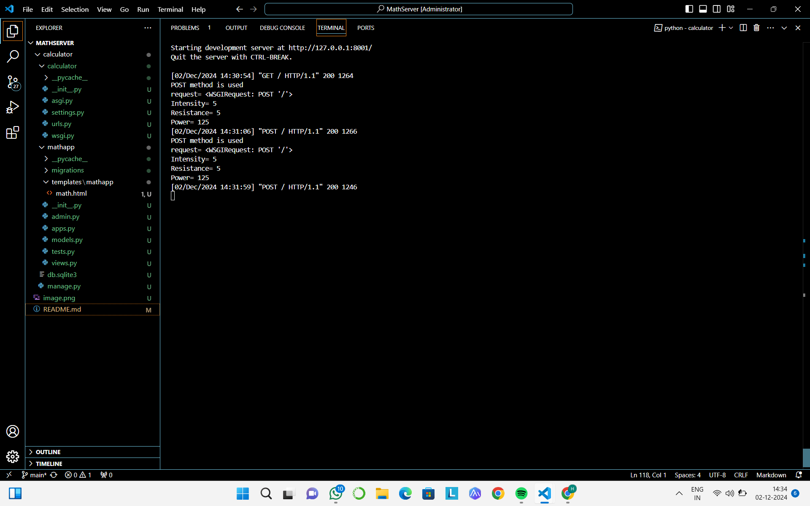
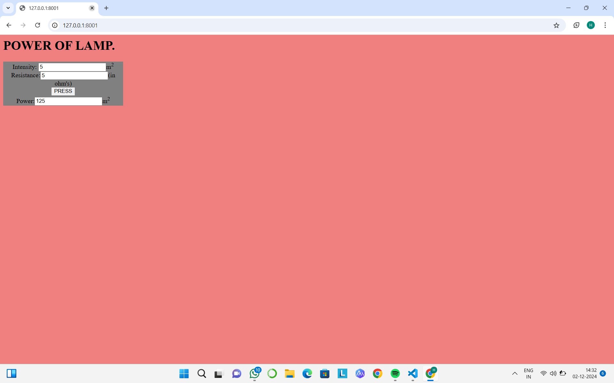

# Ex.05 Design a Website for Server Side Processing
## Date:

## AIM:
 To design a website to calculate the power of a lamp filament in an incandescent bulb in the server side. 


## FORMULA:
P = I<sup>2</sup>R
<br> P --> Power (in watts)
<br> I --> Intensity
<br> R --> Resistance

## DESIGN STEPS:

### Step 1:
Clone the repository from GitHub.

### Step 2:
Create Django Admin project.

### Step 3:
Create a New App under the Django Admin project.

### Step 4:
Create python programs for views and urls to perform server side processing.

### Step 5:
Create a HTML file to implement form based input and output.

### Step 6:
Publish the website in the given URL.

## PROGRAM :
```
math.html
<html>
    <head>
        <style>
          .container{
            width: 300px;
            border: 2px;
            background-color: grey;
            text-align: center;
            align:center;
            
            padding: 0px;

          }
         
            

        </style>
    </head>
    
    <body bgcolor="lightcoral">
        
        <div class="formelt" allign="center"><h1>POWER OF LAMP.</h1> </div>
        <form method="POST" allign="center">
            
            <div class="container" allign="center">
             Intensity: <input type="text" name="intensity" value={{i}}></input>m<sup>2</sup><br/>

            </div>
            <div class="container">
                Resistance:<input type="text" name="resistance" value={{r}}></input>(in ohm's)<br/>

            </div>
            <div class="container">
                <input type="submit" value="PRESS"></input><br/>

            </div>
            <div class="container">
                Power:<input type="text" name="power" value={{power}}></input>m<sup>2</sup><br/>            
            </div>
        </form>
    </body>
    
</html>

view.py

from django.shortcuts import render 
def power(request): 
    context={} 
    context['power'] = "0" 
    context['i'] = "0" 
    context['r'] = "0" 
    if request.method == 'POST': 
        print("POST method is used")
        i = int(request.POST.get('intensity','0'))
        r = int(request.POST.get('resistance','0'))
        print('request=',request) 
        print('Intensity=',i) 
        print('Resistance=',r) 
        power = i*i*r
        context['power'] = power
        context['i'] = i
        context['r'] = r
        print('Power=',power) 
    return render(request,'mathapp/math.html',context)

urls.py

from django.contrib import admin 
from django.urls import path 
from mathapp import views 
urlpatterns = [ 
    path('admin/', admin.site.urls), 
    path('power/',views.power,name="power"),
    path('',views.power,name="power")
]
```


## SERVER SIDE PROCESSING:



## HOMEPAGE:


## RESULT:
The program for performing server side processing is completed successfully.
